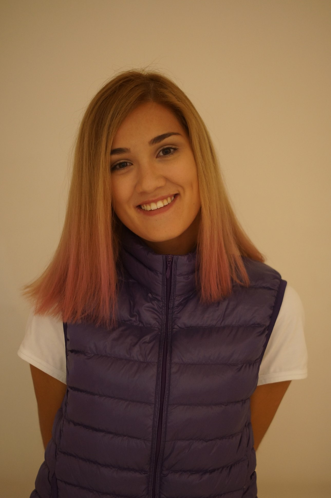

# Maltseva Tamara Nikolayevna
### Female, born on 20 January.

Graduated from St. Petersburg Technological University. Worked as a trade marketing manager for several years. Interested in mastering a game engine or library for creating game mechanics. Currently in the process of learning React. My passion is good design and high functionality of the surrounding space.

bacardeonie@gmail.com — _preferred means of communication_

- Citizenship: Russia
- Ready to relocate, ready for business trips

## Contact Info

- E-mail: [bacardeonie@gmail.com](bacardeonie@gmail.com)
- LinkedIn: [Tamara Maltseva](https://www.linkedin.com/in/tamara-maltseva-364292179/)
- GitHub: [TMaltseva](https://github.com/TMaltseva)
- Discord: [Tommy (@TMaltseva)]()
  
## Desired position and salary

#### Frontend Developer
- HTML5
- CSS/Sass
- JavaScript/Typescript
- Version control: Git (remote service GitHub)
- Figma, Photoshop
- VSCode
- React

## Professional development, courses


2023    | HTML, CSS
HTML-Academy

2024    | Frontend-developer
RSSchool Frontend course 2023Q4


## Education

Higher
2020   | St. Petersburg State Technological Institute (Technical University), St.Petersburg
Economics and management, Personnel management

## Key skills

Languages  | Russian — Native, English — B2 — Upper Intermediate, Spanish — B1 — Intermediate
Soft skills  | Work ethic, attention to details, creativity, empathy, adaptability

## Code examples
```
export default class BaseComponent<T extends HTMLElement = HTMLElement> {
  node: T;

  constructor(tag: string, className: string = '') {
    this.node = document.createElement(tag) as T;

    if (className) {
      this.node.classList.add(className);
    }
  }
}
```

## Examples of Projects

> [Progress Component](https://github.com/TMaltseva/progress-component/)<br>
> [Rick and Morty app](https://tmaltseva.github.io/rick-and-morty-app/)<br>
> [News API](https://rolling-scopes-school.github.io/tmaltseva-JSFE2024Q4/news-api/)<br>
> [Decision Making Tool](https://rolling-scopes-school.github.io/tmaltseva-JSFE2024Q4/decision-making-tool/)<br>
> [Fun Chat](https://rolling-scopes-school.github.io/tmaltseva-JSFE2024Q4/fun-chat/)<br>
> [Simon-says](https://rolling-scopes-school.github.io/tmaltseva-JSFE2024Q4/simon-says/)<br>
> [Nonograms](https://rolling-scopes-school.github.io/tmaltseva-JSFE2024Q4/nonograms/)<br>
> [Image gallery](https://rolling-scopes-school.github.io/tmaltseva-JSFEPRESCHOOL2023Q2/image-gallery/)<br>
> [E-Commerce App Team Task](https://keep-calm-and-code.netlify.app/)<br>